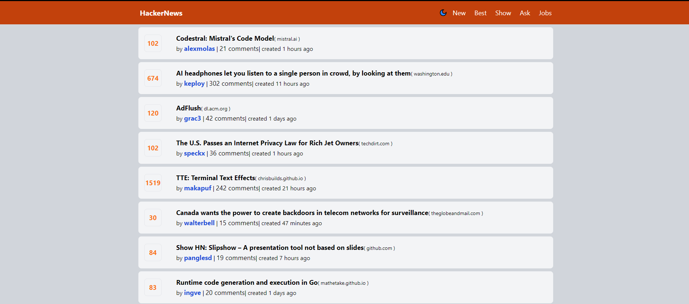
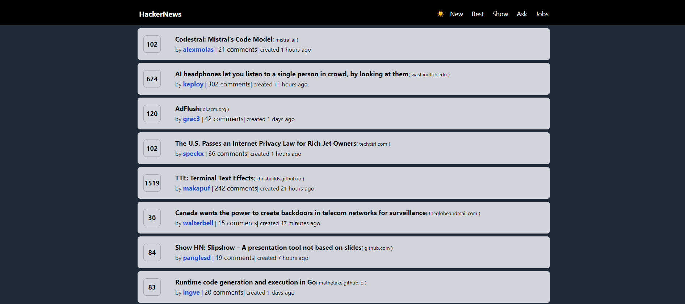
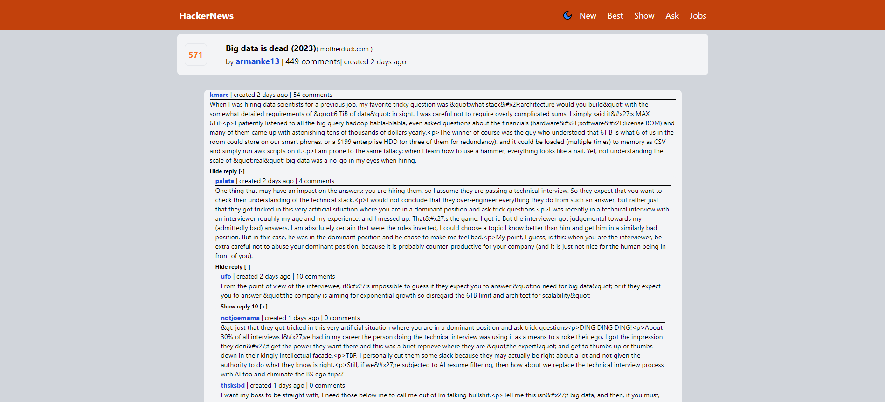
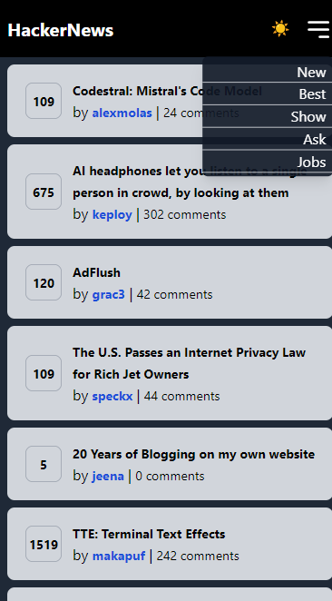
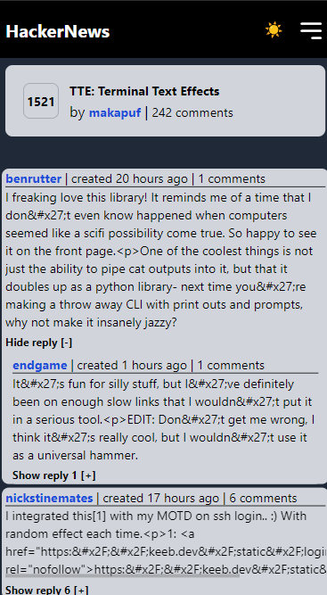

# HackerNews

Build with vue3 and TailwindCSS

[Hosted on Vercel](https://hacker-news-gold-tau.vercel.app/)

## Features

- Client Side Rendering
- Vite-based hot module replacement (HMR) dev environment
- Content loader
- Lazy load comment
- Dark Mode
- Mobile Responsive
